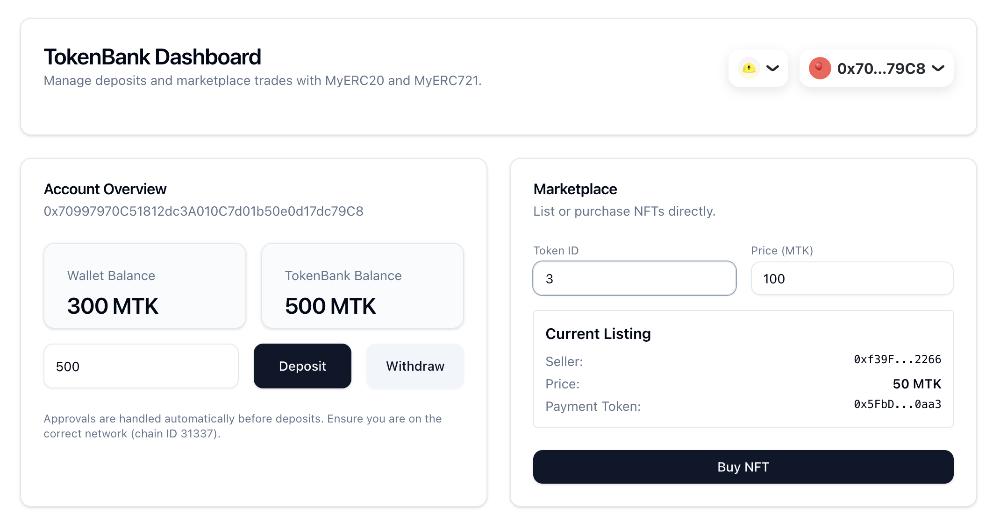

# NFT Market Demo

A full-stack NFT marketplace built with Foundry, Next.js, and Web3 technologies.

## 📸 Screenshots

<!-- Add your screenshots here after taking them -->

### Wallet Connection


### NFT Listing


### NFT Purchase


## ✨ Features

- 🔐 **Wallet Connection**: Connect with MetaMask, WalletConnect, and other wallets via RainbowKit
- 🎨 **NFT Listing**: List your ERC721 NFTs for sale with automatic approval
- 💰 **NFT Purchase**: Buy NFTs with ERC20 tokens (automatic token approval)
- 📊 **Real-time Events**: Live updates for marketplace activities
- 🎯 **Token Banking**: Deposit and withdraw ERC20 tokens
- 🌐 **Local Development**: Full Anvil (local Ethereum node) support

## 🛠 Tech Stack

### Smart Contracts
- **Foundry**: Smart contract development framework
- **Solidity ^0.8.24**: Smart contract language
- **OpenZeppelin**: Standard contract implementations

### Frontend
- **Next.js 15**: React framework with App Router
- **TypeScript**: Type-safe development
- **RainbowKit 2.1.0**: Wallet connection UI
- **Wagmi 2.11.0**: React Hooks for Ethereum
- **Viem 2.17.0**: TypeScript Ethereum library
- **Tailwind CSS**: Utility-first CSS framework
- **shadcn/ui**: Re-usable UI components
- **Sonner**: Toast notifications

## 📦 Smart Contracts

- **MyERC20**: Custom ERC20 token with callback support
- **MyERC721**: NFT collection with URI storage
- **TokenBank**: Deposit and withdraw ERC20 tokens
- **NFTMarket**: List and purchase NFTs with ERC20 tokens

## 🚀 Getting Started

### Prerequisites

- [Node.js](https://nodejs.org/) (v18+)
- [pnpm](https://pnpm.io/) (v8+)
- [Foundry](https://book.getfoundry.sh/getting-started/installation)

### Installation

1. **Clone the repository**
```bash
git clone https://github.com/davidweb3-ctrl/nft-market-demo.git
cd nft-market-demo
```

2. **Install dependencies**
```bash
# Install Foundry dependencies
forge install

# Install Node.js dependencies
pnpm install
```

3. **Set up environment variables**
```bash
cd frontend
cp .env.example .env.local
```

Edit `.env.local`:
```env
NEXT_PUBLIC_WALLETCONNECT_PROJECT_ID=your_project_id_here
NEXT_PUBLIC_TOKEN_ADDRESS=0x5FbDB2315678afecb367f032d93F642f64180aa3
NEXT_PUBLIC_CHAIN_ID=31337
```

### Development

1. **Start Anvil (local Ethereum node)**
```bash
anvil
```

2. **Deploy contracts** (in a new terminal)
```bash
# Deploy MyERC20 and TokenBank
forge script script/DeployTokenBank.s.sol --broadcast --rpc-url http://127.0.0.1:8545

# Deploy MyERC721 and NFTMarket
forge script script/DeployNFTMarket.s.sol --broadcast --rpc-url http://127.0.0.1:8545
```

3. **Update contract addresses**

After deployment, update the contract addresses in:
- `packages/contracts/src/tokenBank.ts`
- `packages/contracts/src/nftMarket.ts`
- `frontend/.env.local`

4. **Start the frontend**
```bash
cd frontend
pnpm dev
```

5. **Open the app**
```
http://localhost:3000
```

### Testing Smart Contracts

```bash
# Run all tests
forge test

# Run tests with gas report
forge test --gas-report

# Run specific test
forge test --match-test testDeposit
```

## 📝 Usage Guide

### Connect Wallet

1. Click "Connect Wallet" button
2. Select your wallet (MetaMask, WalletConnect, etc.)
3. Approve the connection
4. Ensure you're on Anvil network (Chain ID 31337)

### Add Anvil Network to MetaMask

- **Network Name**: Anvil (Localhost)
- **RPC URL**: `http://127.0.0.1:8545`
- **Chain ID**: `31337`
- **Currency Symbol**: `ETH`

### Import Test Account to MetaMask

Use Anvil's default test accounts:

**Account #1 (Deployer)**
- Address: `0xf39Fd6e51aad88F6F4ce6aB8827279cffFb92266`
- Private Key: `0xac0974bec39a17e36ba4a6b4d238ff944bacb478cbed5efcae784d7bf4f2ff80`

**Account #2 (Buyer)**
- Address: `0x70997970C51812dc3A010C7d01b50e0d17dc79C8`
- Private Key: `0x59c6995e998f97a5a0044966f0945389dc9e86dae88c7a8412f4603b6b78690d`

### Mint NFTs

```bash
cast send <MyERC721_ADDRESS> "mint(address,string)" <YOUR_ADDRESS> "https://example.com/nft/1.json" \
  --private-key <YOUR_PRIVATE_KEY> \
  --rpc-url http://127.0.0.1:8545
```

### List an NFT

1. Enter Token ID
2. Enter Price (in MTK tokens)
3. Click "List NFT"
4. Approve NFT (Transaction 1)
5. Confirm listing (Transaction 2)

### Purchase an NFT

1. Switch to a different wallet account
2. Enter the Token ID of a listed NFT
3. Click "Buy NFT"
4. Approve payment token (Transaction 1)
5. Confirm purchase (Transaction 2)

## 📚 Project Structure

```
nft-market-demo/
├── src/                    # Smart contracts
│   ├── MyERC20.sol
│   ├── MyERC721.sol
│   ├── TokenBank.sol
│   └── NFTMarket.sol
├── script/                 # Deployment scripts
│   ├── DeployTokenBank.s.sol
│   └── DeployNFTMarket.s.sol
├── test/                   # Contract tests
│   ├── MyERC20.t.sol
│   ├── MyERC721.t.sol
│   └── NFTMarket.t.sol
├── packages/
│   └── contracts/          # Contract ABIs and addresses
│       └── src/
│           ├── abi/
│           ├── tokenBank.ts
│           └── nftMarket.ts
└── frontend/               # Next.js application
    ├── src/
    │   ├── app/
    │   ├── components/
    │   └── lib/
    └── package.json
```

## 🔧 Troubleshooting

### WalletConnect Issues

If you encounter WalletConnect errors, clear your browser's localStorage:
```javascript
localStorage.clear()
```

### Chain ID Mismatch

Make sure your MetaMask is connected to the Anvil network (Chain ID 31337).

### Contract Not Deployed

Ensure you've run the deployment scripts and updated the contract addresses in the configuration files.

## 🤝 Contributing

Contributions are welcome! Please feel free to submit a Pull Request.

## 📄 License

This project is licensed under the MIT License.

## 🙏 Acknowledgments

- [Foundry](https://book.getfoundry.sh/)
- [OpenZeppelin](https://www.openzeppelin.com/)
- [RainbowKit](https://www.rainbowkit.com/)
- [Wagmi](https://wagmi.sh/)
- [Next.js](https://nextjs.org/)
- [shadcn/ui](https://ui.shadcn.com/)

---

Built with ❤️ using Foundry and Next.js
